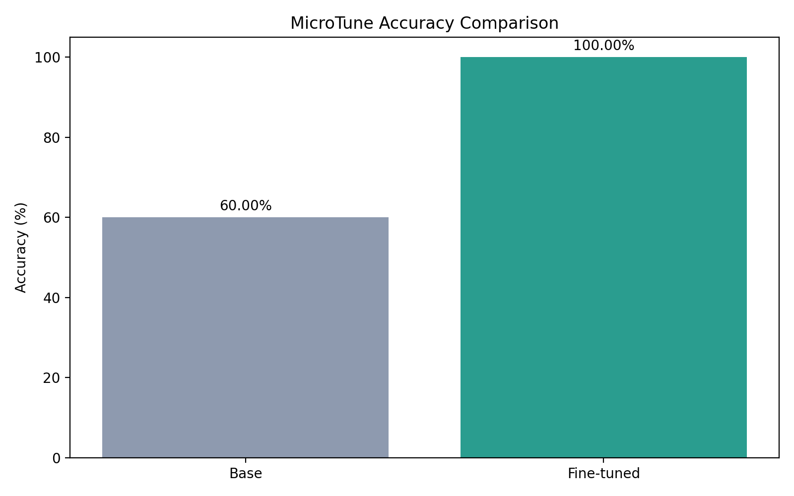
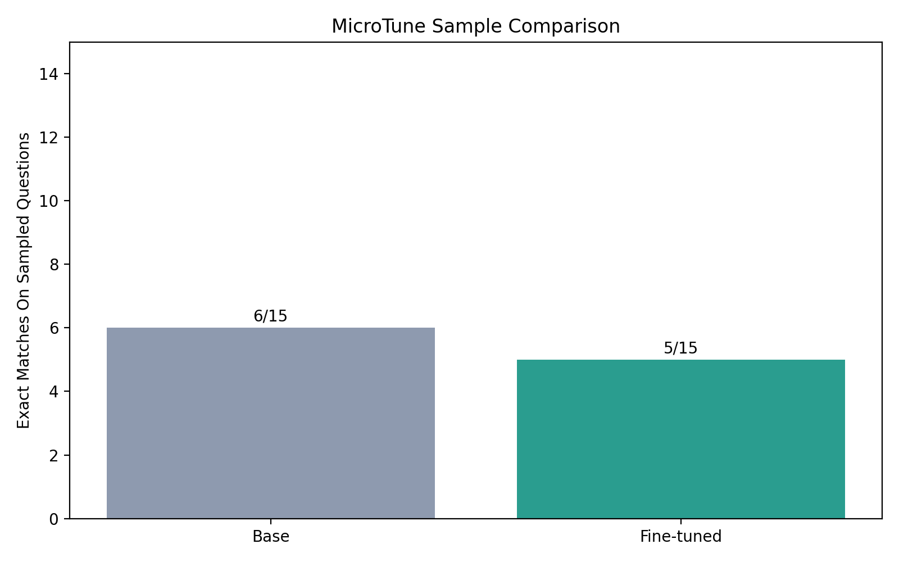

# MicroTune

MicroTune is a Gemma-based math reasoning project built around a LoRA adapter for GSM8K-style question answering. The repo includes preprocessing, fine-tuning, evaluation, an inference API, a Gradio UI, and LoRA merge/export utilities.

## Stack

- Base model target: `google/gemma-2b`
- Fine-tuned adapter: `microtune_final/`
  - expected to contain the LoRA artifacts pulled from your Kaggle training run
- Training method: LoRA with PEFT
- Dataset: GSM8K-style math reasoning
- Local evaluation runtime: macOS on `mps` if available, otherwise `cpu`
- Serving:
  - FastAPI at [api/app.py](/Users/shashankmk/Documents/Projects-Development/MicroTune/api/app.py)
  - Gradio UI at [ui/app.py](/Users/shashankmk/Documents/Projects-Development/MicroTune/ui/app.py)
- Evaluation:
  - exact-match accuracy at [evaluation/eval.py](/Users/shashankmk/Documents/Projects-Development/MicroTune/evaluation/eval.py)
  - side-by-side comparison at [evaluation/compare.py](/Users/shashankmk/Documents/Projects-Development/MicroTune/evaluation/compare.py)

## Project Layout

```text
MicroTune/
├── api/
│   └── app.py
├── datasets/
│   ├── preprocess.py
│   └── tokenize.py
├── evaluation/
│   ├── compare.py
│   └── eval.py
├── microtune_final/
├── merged_model/
├── scripts/
│   ├── export_gguf.md
│   └── merge_lora.py
├── training/
│   └── train.py
├── ui/
│   └── app.py
├── README.md
└── run.md
```

## Quick Start

If `microtune_final/` is already present from Kaggle, you can skip training and use the repo directly for evaluation, serving, merge, and export.

### 1. Create An Environment

```bash
python3.12 -m venv .venv
source .venv/bin/activate
python -m pip install --upgrade pip setuptools wheel
pip install -r requirements.txt
```

If `bitsandbytes` fails on macOS, install the rest manually:

```bash
pip install torch transformers datasets peft trl accelerate evaluate wandb fastapi uvicorn gradio matplotlib
```

### 2. Authenticate With Hugging Face

```bash
huggingface-cli login
```

### 3. Prepare The Dataset

```bash
python datasets/preprocess.py
```

### 4. Run The API

```bash
python api/app.py
```

Health check:

```bash
curl http://127.0.0.1:8000/health
```

### 5. Run The UI

```bash
python ui/app.py
```

### 6. Evaluate

```bash
python evaluation/eval.py
```

This runs locally on your MacBook and writes:

- `results/eval_metrics.json`
- `results/accuracy_comparison.png`

### 7. Compare Outputs

```bash
python evaluation/compare.py --samples 10
```

This runs locally on your MacBook and writes:

- `results/compare_samples.json`
- `results/sample_match_comparison.png`

### 8. Merge The Adapter

```bash
python scripts/merge_lora.py
```

## Important Notes

- The current training script requires CUDA and does not train on macOS as-is.
- If `microtune_final/` already contains the trained adapter from Kaggle, you do not need to run `training/train.py` again.
- The adapter metadata in `microtune_final/adapter_config.json` currently points to `google/gemma-2-2b-it`. The newer evaluation and serving scripts automatically resolve that if needed.
- `evaluation/eval.py` and `evaluation/compare.py` are now Mac-local scripts and prefer `mps` first, then `cpu`.
- For Mac local deployment, GGUF export plus LM Studio is usually more practical than running the full Hugging Face stack.

## Generated Graphs

Run the local evaluation scripts first, then the generated charts will appear here.

### Accuracy Comparison



### Sample Match Comparison



## Deployment Paths

- Local Python serving: run `api/app.py` with `uvicorn`
- Local GUI usage on Mac: export GGUF and run in LM Studio
- Local model merge/export: run `scripts/merge_lora.py` and the GGUF export flow from your Mac

## Documentation

- Full Mac runbook: [run.md](/Users/shashankmk/Documents/Projects-Development/MicroTune/run.md)
- GGUF export notes: [scripts/export_gguf.md](/Users/shashankmk/Documents/Projects-Development/MicroTune/scripts/export_gguf.md)
